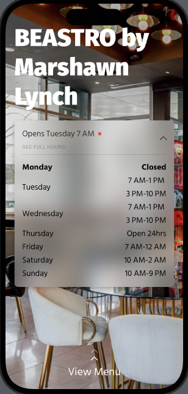

# Purs Challenge

This is a single-screen SwiftUI (MVVM) app made to complete the Purs. Mobile Take Home Assesment 1. The app loads the data from [Purs Demo URL](https://purs-demo-bucket-test.s3.us-west-2.amazonaws.com/location.json) and processes it to be displayed using the [Figma wireframe ](https://www.figma.com/file/5BXJxCRmeOCeWyW9D0ivc7/Mobile-Take-home?node-id=0%3A1&mode=dev).

## Requirements

The following requirements are completed:

- [x] Business details loaded in from given URL
- [x] JSON data parsed to combine days with multiple business shifts
- [x] Late-night shifts combined to form single shifts that span two days
- [x] Shifts from midnight to midnight displayed as 'Open 24h'
- [x] Background image loaded as assests
- [x] View menu button that opens view when draging the text up
- [x] Business operation status light (red, green, yellow)
- [x] Business status text indicating when the business is open until / is opening
- [x] Smooth animations for the operating hours accordian

## Approach

First, I setup the project structure with MVVM and Protocol-Oriented-Development in mind. For this single-screen 'Home' page, I created a 'Home' folder with separate sections for the network layer, viewmodels, models, views, and utilities. Additionally, I imported the custom fonts used in the Figma mockup to a separate 'Files' folder, and added some Date extensions to a 'Utils' folder. These two folders are separete from 'Home' because they could be used in other features in a larger app.

I did my best to separate the business logic into the ViewModel layer and only have the Views displaying data. I made the descision to include a number of computed properties in the different Models, as opposed to the HomeViewModel, since they are vertain fields could be used where the HomeViewModel is not.

One important design choice I made was to parse the JSON file in a separate structures and decode the String dates into actual Dates. First I decoded the entire JSON Business data into the Business Model with the Dates being stored in an array of  'OperatingDaysToDecode' type. Then I took this type and combined duplicate days together to form a new array of OperatingDays where stores a list of OperatingShifts for each of the seven days. This allowed me better format the data when displaying it.

All code written and documented for the best readability possible. Documentation also includes the reasoning behind certain sections and design choices.

## Updates to design

I updated the appearence of Dates to match the user's personal Settings for 12/24 hour time.
I also added a demo menu screen that is shown when the users swipes up on the 'View Menu' text at the bottom of the screen.

## Possible Future Improvements

- [] Separate the logic for the Accordian into a separate ViewModel if the accordian requires more complexity in the future.
- [] Add UI and Unit tests to better test the code. Specifically each computed property for the Business, OperatingDay, and OperatinShift models. I would create mocks for model and the viewmodel to test them. Unfortunatley, my weeks was pretty stacked and I ran out of time to add tests.
- [] Add a completed Menu screen

## Screenshots

 
 
 
